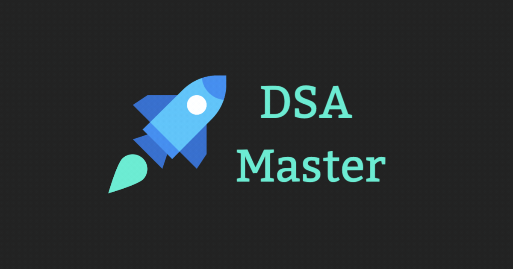

# 🚀 **Ultimate LeetCode Resources for DSA Mastery & Coding Interviews**  

  

This repository is your one-stop destination for mastering **Data Structures and Algorithms (DSA)** while preparing for **coding interviews**! 💡 Dive into **curated resources, patterns, problem templates, and tools** designed to level up your problem-solving skills.  

---

## 💡 **Tips for Getting Started**  
- 🚀 **How to Start LeetCode**  
- 📖 **How I Mastered DSA**  

---

## 📌 **Fundamental Concepts**  
- Algorithmic Complexity  
- Big-O Cheat Sheet  
- Bit Manipulation Techniques  
- Sorting Algorithms  
- Linked Lists, Queues, Stacks  
- Recursion & Backtracking  
- Trees, Tries, Graph Theory  
- Dynamic Programming & Greedy Algorithms  

---

## 🚀 **Patterns to Ace LeetCode**  
- **Sliding Window**  
- **Two Pointers**  
- **Prefix Sum**  
- **Monotonic Stack**  
- **Modified Binary Search**  
- **Tree Traversal & Graph DFS/BFS**  

---

## 📝 **Must-Read Articles**  
- Sliding Window Template  
- Two Pointers Patterns  
- Backtracking Problem Approach  
- Dynamic Programming Patterns  
- Substring Problem Templates  

---

## 📺 **Best Video Playlists**  
🎥 **Abdul Bari’s Algorithms**  
🎥 **William Fiset’s Graphs & Data Structures**  
🎥 **Tushar Roy’s Dynamic Programming**  

---

## 📚 **Recommended Books**  
- **Data Structures and Algorithms Made Easy**  
- **Cracking the Coding Interview**  

---

## 🔎 **Visualize Algorithms**  
- **[VisuAlgo](https://visualgo.net/)**  
- **Algo-lens**  

---

## ✅ **Curated Problem Lists**  
- Blind 75  
- LeetCode Top 100 Liked Questions  
- Top Interview 150 Problems  

---

## 💻 **Must-Do Problems by Topic**  
- **Linked List**: Reverse, Cycle Detection, Merge Sorted Lists, etc.  
- **Binary Trees**: Invert, Flatten, Validate BST, Path Sums, etc.  
- **Backtracking**: Permutations, Subsets, N-Queens, Sudoku Solver, etc.  
- **Tries**: Longest Common Prefix, Search Suggestions, etc.  

---

### 🌟 **Your Contributions Are Welcome!**  
Feel free to fork, star ⭐️, and contribute! Collaboration helps us all grow. 🚀  

---

Add a dynamic image like a LeetCode profile widget or a GitHub activity graph at the bottom:  

  
  

Let’s level up together! 💡  

---  

This format is visually appealing, informative, and engaging, perfect for a GitHub audience. Replace placeholders like "yourusername" and banner image URL with your actual details. 🚀
